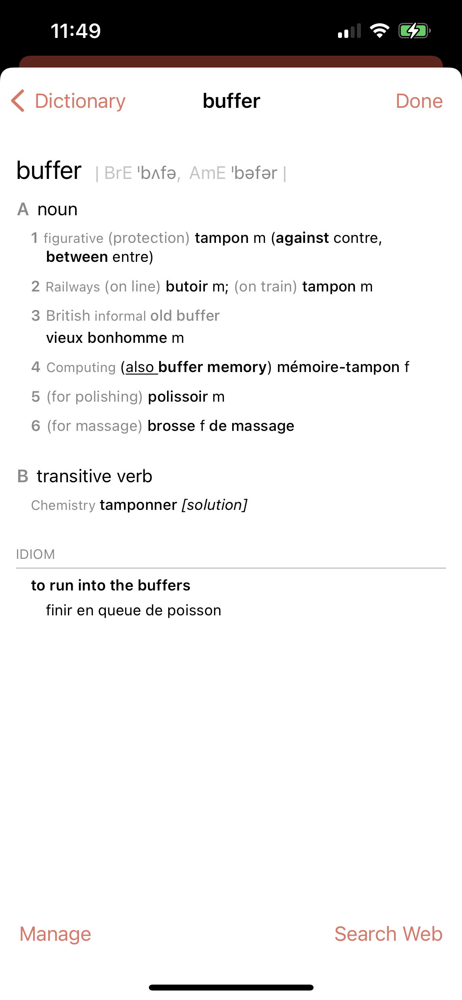

# Kotoba

Quickly search the built-in iOS dictionary to see definitions of words. Collect words you want to remember.

|  |  |
| ---------------------------------------- | --------------------------- |

## Installation (iPhone or iPad)

**Note:** An Apple Developer account is required.

1. Clone or download [Kotoba from GitHub](https://github.com/willhains/Kotoba).
2. Open `code/Kotoba.xcodeproj` in Xcode.
3. Select the Kotoba project file in Navigator, select the "Kotoba" target, then select the "Signing & Capabilities" tab.
4. Change the "Team" to your Apple Developer account team.
5. Change the "Bundle Identifier" to com._yourdomain_.Kotoba.
6. Change the "App Groups" to groups.com._yourdomain_.Kotoba by adding yours, and deleting the current one.
7. Select the "ShareExtension" target, and repeat the three steps above.
8. Open the "Devices and Simulators" window (Shift-Cmd-2) and confirm your device is connected. If not, connect it via USB.
9. Product > Run.

## How to Use

1. Tap "Add a new word".
2. Type or dictate the word you want to look up, and hit the Search key.
3. The iOS system dictionary view will slide up, showing you the definition of the word.
4. If no definition appears, you may not have the right dictionaries installed. Tap "Manage" in the bottom-left of the screen, and download the appropriate dictionaries.
5. Tap Done, and you're back at the main screen. The word you just looked up is added to the word history list.
6. You can delete words from the list by swiping left and tapping "Delete".

## Why Kotoba?

The original idea came from [@gruber](https://twitter.com/gruber) in a DM to [@DFstyleguide](https://twitter.com/DFstyleguide):

> Ever find a good iPhone dictionary app?
>
> Best I’ve found is Terminology, but it’s so complicated I usually just fire up Vesper and use the system “Define” service.
>
> The system one is good; and it’s perfect for when I’m reading in an app. I find it fiddly to use though when I’m reading a printed book.
>
> I want:
>
> 1. Open dictionary app.
> 2. Start typing word to look up.
> 3. Read definition.
>
> Instead I have to:
>
> 1. Open Vesper
> 2. Open a note
> 3. Type the word I’m looking for
> 4. Select the word, tap Define
> 5. Read definition.
> 6. Close dictionary and delete the word from my note.

## Development Status

Kotoba is in a bare-bones state, with just enough functionality to be useful.

As far as I know, it works fine. But if you find any bugs, or have suggestions for improvement, please [raise an issue on GitHub](https://github.com/willhains/Kotoba/issues). Any feedback is heartily welcome.

## Why Open-Source?

Look, ladies and gents, you are much smarter than I. I am a working developer, but Swift/iOS is not my day job. I made this open-source for two reasons:

- Honestly, I suspected Kotoba wouldn't be approved for the App Store. If it's open-source, the Xcode-savvy can at least install it on their personal devices.
- If smarter, more experienced Swift developers can suggest improvements or fix my bugs, I will learn from them.

Which is a nice segue to... [how to contribute](CONTRIBUTING.md)
